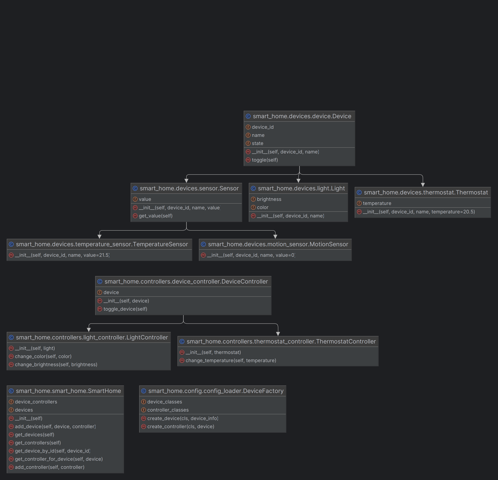

# PySmartHome
Smart Home Automation Python App

## Gruppe 5 (Fünf)
- Lisa Ress-Park
- Johanna Deike
- Aidan Zimmer
- Kevin Rieger
- Dennis Bollian
- Luca Chmielarski

## Angewendete SOLID-Prinzipien

### Single Responsibility Principle (SRP)
Jede Klasse hat eine einzelne Verantwortung. Zum Beispiel ist das `config_loader` Modul nur für das Laden der Konfiguration zuständig, und jede Device-Unterklasse implementiert das spezifische Verhalten eines bestimmten Gerätetyps.

### Open-Closed Principle (OCP)
Der Code ist für Erweiterungen offen und für Modifikationen geschlossen. Neue Gerätetypen können leicht hinzugefügt werden, indem eine neue Klasse erstellt und im `device_classes` Wörterbuch von `DeviceFactory` registriert wird, ohne Änderungen an der DeviceFactory-Klasse oder dem `config_loader` Modul.

### Liskov Substitution Principle (LSP)
Unterklassen können ihre Basisklassen ohne Nebenwirkungen ersetzen. Die Geräte- und Sensor-Klassen sind durch Erweiterung und Anpassung der Device- und Sensor-Klassen entworfen worden, was dieses Prinzip erfüllt.

### Interface Segregation Principle (ISP)
Keine unnötigen Abhängigkeiten durch breite Interfaces. Jeder Controller interagiert nur mit den Methoden, die er benötigt (z.B. `toggle` für `DeviceController`), und das `Device` Interface ist klein und fokussiert.

### Dependency Inversion Principle (DIP)
Hohe Modulniveaus und niedrige Modulniveaus hängen von Abstraktionen ab. Es gibt keine direkten Abhängigkeiten zwischen den Modulen in diesem Projekt. Beispielsweise ist die DeviceController-Klasse nur von der abstrakten Device-Klasse abhängig und nicht von spezifischen Geräteklassen.

## Angewendete Entwurfsmuster

### Factory Pattern
Das Factory Pattern wird verwendet, um die Erzeugung von Geräten und Controllern zu steuern. Die DeviceFactory-Klasse verwaltet die Registrierung und Erzeugung von spezifischen Gerätetypen und den zugehörigen Controllern, wodurch die Erzeugungslogik zentralisiert und vereinfacht wird.

### Template Method Pattern
Dieses Muster wird durch die Definition von Basisverhalten in der Device-Klasse und die Anpassung dieses Verhaltens in den spezifischen Geräteklassen angewendet. Die Methode `toggle` in der Device-Klasse definiert ein allgemeines Verhalten, das in den spezifischen Geräteklassen angepasst werden kann.

### Command Pattern
Das Command Pattern wird in diesem Projekt durch die Controller-Klassen angewendet, die als Kommandos fungieren. Jeder Controller hat eine Methode zum Ändern des Zustands eines Geräts (z.B. toggle), die in der GUI aufgerufen wird, wenn der Benutzer eine Aktion ausführt.

