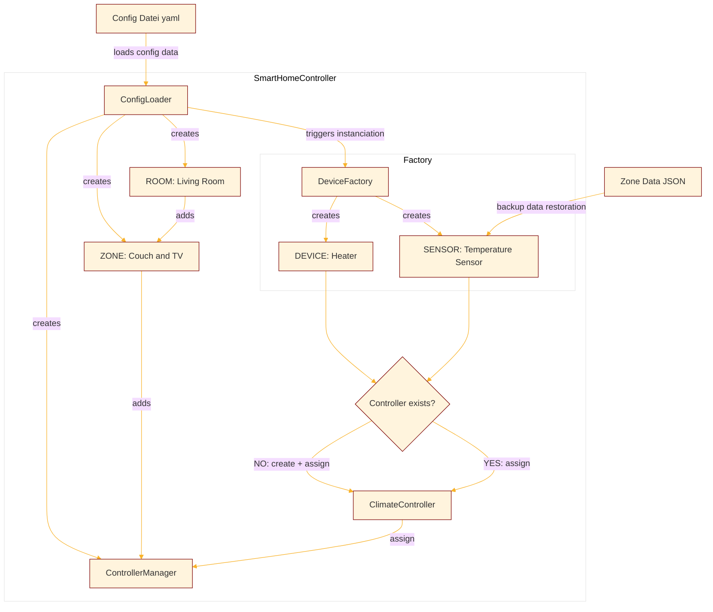
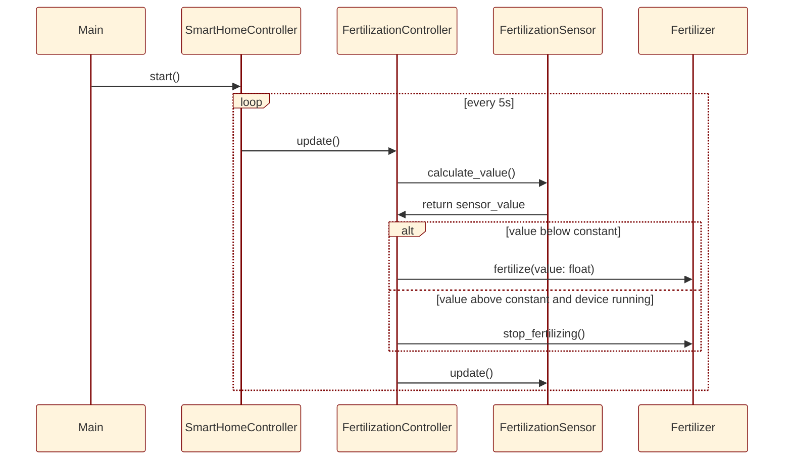
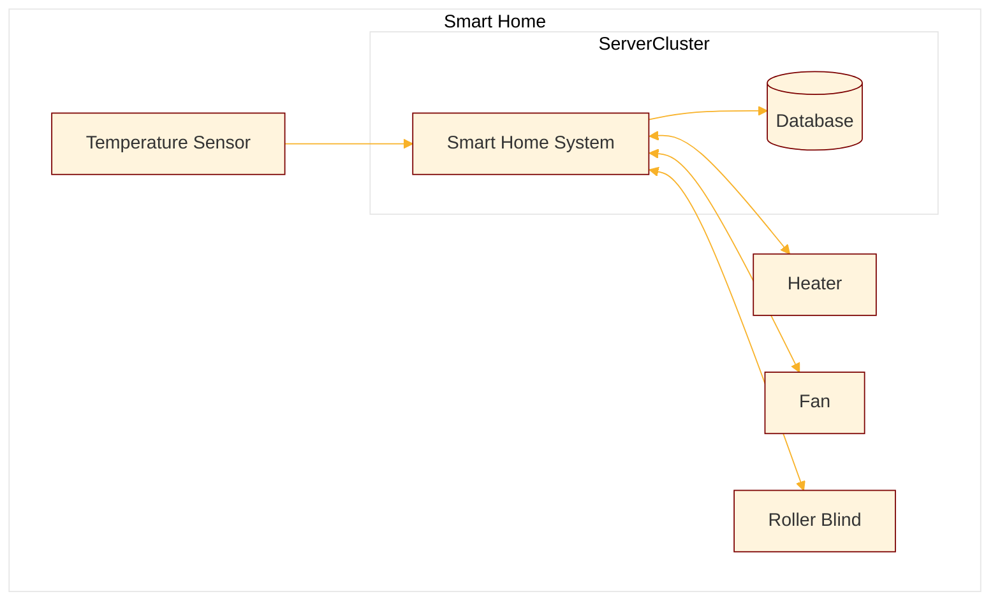

# PySmartHome Dokumentation
<!-- TOC -->
* [PySmartHome Dokumentation](#pysmarthome-dokumentation)
* [1 Einführung und Ziele](#1-einführung-und-ziele)
  * [Aufgabenstellung](#aufgabenstellung)
    * [Was ist das PySmartHome?](#was-ist-das-pysmarthome)
    * [Wesentliche Features](#wesentliche-features)
    * [Treibende Kräfte](#treibende-kräfte)
  * [Qualitätsziele](#qualitätsziele)
  * [Stakeholder](#stakeholder)
* [2 Randbedingungen](#2-randbedingungen)
  * [Technische Randbedingungen](#technische-randbedingungen)
  * [Organisatorische Randbedingungen](#organisatorische-randbedingungen)
  * [Konventionen](#konventionen)
* [3 Kontextabgrenzung {#section-system-scope-and-context}](#3-kontextabgrenzung-section-system-scope-and-context)
  * [Fachlicher Kontext {#_fachlicher_kontext}](#fachlicher-kontext-fachlicherkontext)
  * [Technischer Kontext {#_technischer_kontext}](#technischer-kontext-technischerkontext)
* [4 Lösungsstrategie](#4-lösungsstrategie)
  * [Auswahl von Python als Programmiersprache](#auswahl-von-python-als-programmiersprache)
  * [Verpflichtung zu Best Practices und hochwertiger Softwareentwicklung](#verpflichtung-zu-best-practices-und-hochwertiger-softwareentwicklung)
* [Struktur und Modulare Architektur](#struktur-und-modulare-architektur)
* [Konfigurierbarkeit und Anpassungsfähigkeit](#konfigurierbarkeit-und-anpassungsfähigkeit)
* [Systematisches Logging](#systematisches-logging)
* [5 Bausteinsicht {#section-building-block-view}](#5-bausteinsicht-section-building-block-view)
  * [Whitebox Gesamtsystem {#_whitebox_gesamtsystem}](#whitebox-gesamtsystem-whiteboxgesamtsystem)
  * [Ebene 2 {#_ebene_2}](#ebene-2-ebene2)
  * [Ebene 3 {#_ebene_3}](#ebene-3-ebene3)
* [6 Laufzeitsicht](#6-laufzeitsicht)
  * [Systemstart](#systemstart)
    * [Ausschnitt der `config.yaml`](#ausschnitt-der-configyaml)
    * [Instanziierungsprozess](#instanziierungsprozess)
  * [Verhalten zur Laufzeit](#verhalten-zur-laufzeit)
* [7 Verteilungssicht](#7-verteilungssicht)
* [8 Querschnittliche Konzepte](#8-querschnittliche-konzepte)
  * [Architektur-/ Entwurfsmuster](#architektur--entwurfsmuster)
    * [Factory Pattern](#factory-pattern)
    * [Template Method Pattern](#template-method-pattern)
    * [Strategy Pattern](#strategy-pattern)
    * [Adapter Pattern](#adapter-pattern)
    * [Command Pattern](#command-pattern)
  * [Logging](#logging)
  * [Tests](#tests)
* [9 Architekturentscheidungen](#9-architekturentscheidungen)
* [10 Qualitätsanforderungen](#10-qualitätsanforderungen)
  * [Qualitätsbaum](#qualitätsbaum)
  * [Qualitätsszenarien](#qualitätsszenarien)
* [11 Risiken und technische Schulden {#section-technical-risks}](#11-risiken-und-technische-schulden-section-technical-risks)
* [12 Glossar](#12-glossar)
* [Aufgabenverteilung](#aufgabenverteilung)
<!-- TOC -->

# 1 Einführung und Ziele

## Aufgabenstellung

### Was ist das PySmartHome?

* Das PySmartHome ist ein voll funktionsfähiges Smart Home-System in Python.
* Das Projekt dient als anschauliches Beispiel für den Entwurf, die Bewertung und die Dokumentation
  von Softwarearchitekturen im Kontext von Smart Home-Systemen.

### Wesentliche Features

* PySmartHome bietet eine umfassende Implementierung eines Smart
  Home-Systems. Es ermöglicht die intelligente Steuerung verschiedener Geräte und Funktionen im Haushalt
  und bei der Gartenarbeit.
* PySmartHome ist modular aufgebaut und ermöglicht die einfache Integration
  neuer Geräte und Funktionen. Die klare Paketstruktur und die Verwendung von
  Design Patterns erleichtern die Erweiterung des Systems um zusätzliche Smart Home-Geräte.
* PySmartHome unterstützt die Automatisierung von vordefinierten Smart Home-Szenarien.
  Beispielsweise kann das System automatisch die Beleuchtung einschalten und die Raumtemperatur
  anpassen, wenn der Bewohner nach Hause kommt.
* Die Implementierung von PySmartHome erfolgt unter Berücksichtigung von TDD-Praktiken, um die Funktionalität
  des Systems sicherzustellen und Fehler frühzeitig zu erkennen.
* PySmartHome wurde um die Funktionalität eines Smart Indoor Gardening-Systems erweitert.
  Dies ermöglicht die Regelung der Temperatur und Feuchtigkeit in mehreren Zonen, motorische Steuerung
  von Beschattung, Lüfter und Frost-Heizung sowie automatische Bewässerung, künstliche Beleuchtung
  und automatische Düngung.

### Treibende Kräfte

Im Rahmen der Veranstaltung "Kernkonzepte und Methoden" des Kurses WWI21SEB unter der Leitung von
Dozent Michael Binzen im Sommersemester 2023 wurde das Projekt PySmartHome entwickelt. Der Schwerpunkt lag auf
dem System-Design. Es sollte eine Package-Struktur in Python gemäß den SOLID-Prinzipien erstellt werden
sollte. Die Gruppe wurde aufgefordert, eine gründliche Klassen- und Modellierung des Smart
Home-Systems vorzunehmen, Design Patterns angemessen anzuwenden, die SOLID-Prinzipien in der
Package-Struktur zu berücksichtigen und die geforderte Erweiterung für das Gewächshaus (SIG) zu
implementieren. Die Dokumentation soll die getroffenen Entscheidungen im Code kommentieren
und die ausgewählten Testmethoden erläutern.

| Anforderung |                     Beschreibung                      |                                       Quelle                                       |
|:-----------:|:-----------------------------------------------------:|:----------------------------------------------------------------------------------:|
|  SmartHome  |    Es soll ein Smart-Home-System designed werden.     | [Foliensatz KW21](https://moodle.dhbw-mannheim.de/mod/resource/view.php?id=296104) |
|   Python    | Module und Packages solllen in Python gebildet werden | [Foliensatz KW21](https://moodle.dhbw-mannheim.de/mod/resource/view.php?id=296104) |
|     TDD     |              TDD soll praktiziert werden              | [Foliensatz KW21](https://moodle.dhbw-mannheim.de/mod/resource/view.php?id=296104) |
|     SIG     | Das System soll um ein Gewächshaus erweitert werden.  | [Foliensatz KW28](https://moodle.dhbw-mannheim.de/mod/resource/view.php?id=300001) |
|     KI      |            Eine KI muss angebunden werden             | [Foliensatz KW28](https://moodle.dhbw-mannheim.de/mod/resource/view.php?id=300001) |

## Qualitätsziele

Die folgende Tabelle beschrieben die zentralen Qualitätsziele vom PySmartHome wobei die Reihenfolge eine grobe
Orientierung bezüglich der Wichtigkeit vorgibt.

|        Merkmal nach ISO 25010        | Erläuterung                                                                                                                                                                                                                                                                                                                                                                                   |
|:------------------------------------:|:----------------------------------------------------------------------------------------------------------------------------------------------------------------------------------------------------------------------------------------------------------------------------------------------------------------------------------------------------------------------------------------------|
|   Extensibility (Erweiterbarkeit)    | Das Ziel der Erweiterbarkeit ist es, dass PySmartHome einfach um neue Funktionen und Module erweitert werden kann, um zukünftige Änderungen und technologische Entwicklungen im Smart-Home-Bereich zu berücksichtigen. Das System verfolgt eine modulare Architektur und verwendet Design Patterns, um die Integration neuer Funktionen ohne Beeinträchtigung des Kernsystems zu erleichtern. |
| Interoperability (Interoperabilität) | Das PySmartHome-System wurde mit Fokus auf Interoperabilität entwickelt, um eine nahtlose Zusammenarbeit mit externen Komponenten wie einer Künstlichen Intelligenz (und einer Wetterstation) zu ermöglichen.                                                                                                                                                                                 |
|    Maintainability (Wartbarkeit)     | Das Ziel der Maintainability ist es sicherzustellen, dass das PySmartHome-System leicht zu warten und zu pflegen ist, indem es gut strukturierten, dokumentierten und getesteten Code verwendet, um Entwicklern eine effiziente Weiterentwicklung und Fehlerbehebung zu ermöglichen.                                                                                                          |

## Stakeholder

Die folgende Tabelle stellt die Stakeholder des PySmartHomes und ihre jeweilige Intentionen dar.

|                Rolle                 | Erwartung, Interesse, Bezug                                                                                                                                                                                                                                                                                                                                                                                                                                                                                            |
|:------------------------------------:|:-----------------------------------------------------------------------------------------------------------------------------------------------------------------------------------------------------------------------------------------------------------------------------------------------------------------------------------------------------------------------------------------------------------------------------------------------------------------------------------------------------------------------|
|       Softwarearchitekt*innen        | <ul><li>streben danach, eine gut strukturierte und flexible Architektur für das PySmartHome-Projekt zu entwerfen</li><li>legen Wert auf klare Schnittstellen und eine hohe Interoperabilität, um die Integration externer Komponenten wie der KI und der Wetterstation zu ermöglichen</li><li>Ziel ist es, eine robuste Basis zu schaffen, die zukünftige Anforderungen und technologische Entwicklungen problemlos bewältigen kann</li></ul>                                                                          |
|           Entwickler*innen           | <ul><li>setzen die Vorgaben der Softwarearchitektinnen um und streben eine saubere Code-Basis und klare Architektur an, um effizient und produktiv arbeiten zu können</li><li>erwarten klare Aufgabenstellungen und gut dokumentierten Code, um ihre Arbeit erfolgreich umzusetzen und eine reibungslose Integration der externen Komponenten sicherzustellen</li></ul>                                                                                                                                                |
| Nutzer*innen/Kunde  (Michael Binzen) | <ul><li>hat das Interesse, dass die Studierenden die in der Vorlesung vermittelten Inhalte zum Software-Engineering und den Kernkonzepten erfolgreich umsetzen</li><li>erwartet eine sorgfältige Klassen- und Modellierung des PySmartHome-Systems, die Anwendung von Design Patterns und die Berücksichtigung der SOLID-Prinzipien</li><li>legt Wert darauf, dass die Studierenden die theoretischen Konzepte in der Praxis umsetzen und ein gut strukturiertes, erweiterbares Smart-Home-System entwickeln</li></ul> |

# 2 Randbedingungen

## Technische Randbedingungen

|          Randbedingung           | Erläuterung                                                                                                                                                     |
|:--------------------------------:|:----------------------------------------------------------------------------------------------------------------------------------------------------------------|
|        Programmiersprache        | Das Projekt wird in Python umgesetzt.                                                                                                                           |
| Unterstützung von Schnittstellen | Die Interoperabilität mit externen Komponenten wie einer Künstlichen Intelligenz (KI) (und einer Wetterstation) erfordert die Unterstützung von Schnittstellen. |
|        Objektorientierung        | Das PySmartHome-Projekt basiert auf dem Prinzip der Objektorientierung, bei dem die Funktionalität in Form von Klassen und Objekten organisiert ist.            |

## Organisatorische Randbedingungen

|       Randbedingung        | Erläuterung                                                                                                                                                                                                                                   |
|:--------------------------:|:----------------------------------------------------------------------------------------------------------------------------------------------------------------------------------------------------------------------------------------------|
|          Zeitplan          | Die Gruppen haben einen Zeitplan einzuhalten, der die Abgabe von Teilprojekten und die Präsentationen zu bestimmten Terminen vorsieht.                                                                                                        |
| Anforderungen des Dozenten | Das PySmartHome-Projekt sollte die Anforderungen des Dozenten erfüllen, der Wert auf eine sorgfältige Klassen- und Modellierung des Smart Home-Systems, die Anwendung von Design Patterns und die Berücksichtigung der SOLID-Prinzipien legt. |
|       Gruppenarbeit        | Das Projekt wird als Gruppenarbeit durchgeführt, daher ist eine klare Kommunikation und Zusammenarbeit innerhalb der Gruppen eine organisatorische Randbedingung.                                                                             |

## Konventionen

|         Randbedingung          | Erläuterung                                                                                                                                                                                          |
|:------------------------------:|:-----------------------------------------------------------------------------------------------------------------------------------------------------------------------------------------------------|
| Einhaltung von Design Patterns | Die Verwendung bestimmter Design Patterns ist eine Konvention, um bewährte Entwurfsmuster anzuwenden und die Code-Qualität zu verbessern, insbesondere in Bezug auf die Erweiterbarkeit des Systems. |
|          Dokumenation          | Das PySmartHome-Projekt erfordert eine Dokumentation gemäß dem arc42-Template.                                                                                                                       |

# 3 Kontextabgrenzung {#section-system-scope-and-context}

Schnittstelle zu KI / Wetterstation / ...

## Fachlicher Kontext {#_fachlicher_kontext}

## Technischer Kontext {#_technischer_kontext}

+

# 4 Lösungsstrategie

In diesem Abschnitt wird die Strategie zur Lösung der Problemstellungen im Kontext unserer Smart Home Architektur
dargestellt. Wir werden die zentralen Entscheidungen und Lösungsansätze aufzeigen, die sowohl das Design als auch die
Implementierung des Systems prägen.

## Auswahl von Python als Programmiersprache

Python wurde bereits in den frühen Phasen unseres Projekts als bevorzugte Programmiersprache identifiziert. Diese
Entscheidung war von Beginn an eine festgelegte Anforderung und basiert auf den vielfältigen Vorteilen, die Python für
unser spezielles Anwendungsszenario bietet.

Python ist bekannt für seine einfache Syntax, die Lesbarkeit und Verständlichkeit des Codes fördert. Darüber hinaus ist
Python eine äußerst ausdrucksstarke Sprache, die es uns ermöglicht, komplexe Anforderungen mit weniger Codezeilen und
daher weniger Fehlermöglichkeiten zu erfüllen. Diese Eigenschaften machen Python zu einer idealen Wahl für die
Entwicklung von Smart Home Systemen, die eine breite Palette an Funktionen und eine hohe Benutzerfreundlichkeit
erfordern.

Ein weiterer Vorteil von Python liegt in seiner umfangreichen Bibliothekunterstützung, die für unsere Architektur von
entscheidender Bedeutung sind. So können wir effizient hochwertige Lösungen für unser Smart Home System entwickeln,
ohne dabei das Rad neu erfinden zu müssen.

## Verpflichtung zu Best Practices und hochwertiger Softwareentwicklung

Unsere Lösungsstrategie leitet sich stark von den Prinzipien der Software-Engineering-Best-Practices ab. Wir haben uns
auf die Verwendung von Design Pattern und die Einhaltung der SOLID-Prinzipien verpflichtet. Dies garantiert, dass unser
System nicht nur funktional, sondern auch gut strukturiert, erweiterbar und wartbar ist.

Beispielsweise findet das Kommando-Muster Anwendung in der "Commands" Komponente, um unterschiedliche Befehle, wie die
Pflege der Pflanzen, abzubilden. Die Verwendung des Kommando-Musters ermöglicht eine lose Kopplung und erhöht die
Flexibilität unseres Systems.

Die SOLID-Prinzipien, welche eine Sammlung von fünf Prinzipien für die objektorientierte Programmierung und Design
darstellen, haben uns dabei geholfen, den Code so zu strukturieren, dass er gut organisiert, erweiterbar und leicht
verständlich ist. Dies erleichtert die langfristige Wartung und Weiterentwicklung des Systems.

# Struktur und Modulare Architektur

Um eine klare Trennung der Verantwortlichkeiten zu gewährleisten und die Wartbarkeit und Erweiterbarkeit zu verbessern,
haben wir unser Smart Home System in verschiedene Module unterteilt. Jedes Modul repräsentiert einen spezifischen
Aspekt des Gesamtsystems.

Die modulare Struktur ermöglicht es uns, bei Bedarf neue Funktionen und Geräte einfach zu integrieren, ohne das gesamte
System überarbeiten zu müssen. Sie unterstützt auch die Nachvollziehbarkeit und Verständlichkeit des Systems, da jeder
Teil des Codes eine klar definierte Aufgabe hat.

# Konfigurierbarkeit und Anpassungsfähigkeit

Eine wichtige Anforderung unseres Smart Home Systems ist die Fähigkeit, sich an die Bedürfnisse und Vorlieben des
Benutzers anzupassen. Um dies zu erreichen, haben wir die Konfigurierbarkeit und Anpassungsfähigkeit in das Herz
unserer Architektur integriert.

Durch die Verwendung von YAML und JSON für die Speicherung von Konfigurations- und Zonendaten bieten wir den Benutzern
eine flexible und verständliche Möglichkeit, das System nach ihren Wünschen zu konfigurieren.
Die Konfigurationsdaten in `config.yaml` können einfach geändert werden, um das Verhalten des Systems anzupassen, ohne
dass Änderungen am Code erforderlich sind.

# Systematisches Logging

Um die Fehlersuche zu erleichtern und die Nachvollziehbarkeit des Systemzustands zu ermöglichen, haben wir ein
systematisches Logging in unsere Architektur implementiert. Das Logging ist so konzipiert, dass es wertvolle
Informationen über den Zustand und das Verhalten des Systems liefert, was es uns ermöglicht, mögliche Probleme schnell
zu identifizieren und zu beheben.

Unser Logging-Ansatz erfasst nicht nur Fehler, sondern auch wichtige Systemereignisse. Dadurch können wir nicht nur
Probleme diagnostizieren, sondern auch das Systemverhalten im Laufe der Zeit analysieren und gezielte Verbesserungen
vornehmen oder Geräte/Sensoren anpassen.

Insgesamt repräsentiert unsere Lösungsstrategie einen bewussten und durchdachten Ansatz zur Entwicklung eines Smart-Home
Systems, das sich durch seine Benutzerfreundlichkeit, Flexibilität, Erweiterbarkeit und Robustheit auszeichnet.

# 5 Bausteinsicht {#section-building-block-view}

## Whitebox Gesamtsystem {#_whitebox_gesamtsystem}

## Ebene 2 {#_ebene_2}

## Ebene 3 {#_ebene_3}

++ Luca

# 6 Laufzeitsicht

## Systemstart

Bevor das Smart Home System in der Lage ist seine Aufgabe zu erfüllen,
muss das System konfiguriert und initiiert werden. Mithilfe einer `config.yaml`
ist es möglich das System, gemäß realer Anforderungen zu konfigurieren.
Diese Konfigurationen werden eingelesen und die Instanzen daraufhin erstellt.
Nachfolgend ein Beispiel, wie das System auf die Konfiguration reagiert:

### Ausschnitt der `config.yaml`

```
rooms:
  - name: Living Room
    type: liveable
    zones:
      - name: Couch and TV
        devices:
          - name: Heater
            type: heater
        sensors:
          - name: Temperature Sensor
            type: temperature_sensor
```

Diese YAML Datei wird mit folgender Logik ausgelesen, um das Smart Home zu initialisieren:

### Instanziierungsprozess



Dieses Flussdiagramm beschreibt den grundlegenden Ablauf innerhalb des Smart Home Controllers, der die konfigurierten
Geräte und Sensoren in der jeweiligen Zone des Raumes erstellt und sie den passenden Controllern zuweist:

- Die Konfigurationsdatei (YAML) wird geladen und die Daten werden an den "ConfigLoader" übergeben. Dieser Schritt ist
  der Ausgangspunkt für das gesamte System.

- Der `ConfigLoader` erstellt den Raum `Living Room`, die Zone `Couch and TV` und den `ControllerManager` der Zone.
  Dieser wird der Zone hinzugefügt, während die Zone ihren jeweiligen Raum zugewiesen wird.
- Der `ConfigLoader` nutzt die Metadaten in der `config.yaml` und löst eine Instanziierung vom Gerät `Heater` und dem
  Sensor `Temperature Sensor` über die `DeviceFactory` aus, die für die Erstellung von Geräten und Sensoren
  verantwortlich ist.
- Es wird überprüft, ob zu den erstellten Geräten und Sensoren der dazugehörende Controller (`ClimateController`)
  bereits existiert. Dieser ist für die Steuerung der Sensoren und Geräte zuständig. Wenn kein `ClimateController`
  existiert, wird einer erstellt und den Geräten/Sensoren zugewiesen.
  Wenn bereits ein `ClimateController` vorhanden ist, werden die Geräte diesem zugewiesen.
- Abschließend wird der `ClimateController` dem `ControllerManager` zugewiesen, und das Smart Home System ist nun
  vollständig aufgebaut.
- Über eine JSON Datei ist es uns ebenfalls möglich Backup-Werte nach Laufzeitabbruch wiederherzustellen. Diese werden
  nachträglich den jeweiligen Sensoren der Zone zugewiesen.

Zusammenfassend handelt es sich bei diesem Flussdiagramm um eine vereinfachte Darstellung des Smart Homes, mithilfe der
Konfigurationsdatei lassen sich eine Vielzahl an Räumen, Zonen, Geräte und Sensoren erstellen und den richtigen
Controllern zuweisen. Die Visualisierung soll diesen Prozess in seinen Grundzügen veranschaulichen.

## Verhalten zur Laufzeit

Während der Laufzeit koordiniert und steuert sich das Smart Home über seine Sensoren selbst:



Das Sequenzdiagramm beschreibt beispielhaft den Prozess, wie sich der `FertilizationController` in unserem "smarten
Gewächshaus" verhält, um die Düngung (Fertilization) steuern:

- Der Prozess beginnt, wenn die Main-Funktion den `SmartHomeController` aufruft, um die Methode `start()` auszuführen.
  Der `SmartHomeController` ist verantwortlich für die Gesamtsteuerung und Verwaltung des Smart Home Systems.

- In einem wiederholten Schleifenablauf, der alle 5 Sekunden stattfindet, iteriert der `SmartHomeController` über alle
  Räume, Zonen der Räume und Controller der Zonen und ruft somit auch den `FertilizationController` auf, um die
  Düngungssteuerung durchzuführen.
  Das Sequenzdiagramm beschreibt den Prozess, wie der "SmartHomeController" und der "FertilizationController" in
  regelmäßigen Abständen miteinander interagieren, um die Düngung (Fertilization) einer Pflanze zu steuern. Hier ist
  eine Beschreibung des Prozesses:

- Der `FertilizationController` beginnt, indem er alle Sensorwerte aller `FertilizationSensor` abruft. Der Sensor
  ermittelt seinen eigenen Messwert und je nach Strategie wird der Mittel-, Maximal- oder Minimalwert aller Sensoren in
  der Zone berechnet und an den `FertilizationController` zurückgegeben.
- Nachdem der Düngungswert ermittelt wurde, wird eine Bedingung geprüft, ob der aktuelle Wert unter einem vorgegebenen
  Schwellenwert liegt oder nicht.
    - Wenn der Wert unter dem Schwellenwert liegt, ist es notwendig, zu düngen. Der `FertilizationController` ruft die
      Methode `fertilize(value: float)` des `Fertilizer` auf, um die Düngung mit dem berechneten Wert durchzuführen.
      Der `Fertilizer` ist das Gerät oder die Komponente, die für die tatsächliche Düngung der Pflanze verantwortlich
      ist.
    - Wenn der Wert über dem Schwellenwert liegt und das Düngungsgerät bereits läuft, dann muss die Düngung gestoppt
      werden. Der `FertilizationController` ruft die Methode `stop_fertilizing()` des `Fertilizer` auf, um die Düngung
      zu beenden.
- Der Schleifenablauf wird alle 5 Sekunden wiederholt, wodurch die Düngung der Pflanzen periodisch überwacht und
  gesteuert wird.

Neben der klassischen Steuerung ist es mithilfe des Systems möglich während der Laufzeit
Veränderungen des Systems in einer JSON zu speichern, auszulesen und darauf zu reagieren.
Nach jedem Methodenaufruf `update()` wird der aktuelle Status des Gesamtsystems in `zone_data.json` persistiert.
Auch wird in dieser Methode überprüft, ob sich die `config.yaml` geändert hat. In diesem Fall wird das System ein "
Reboot" durchführen und aus `zone_data.json` die neue Systemlandschaft mit den alten Daten wiederherstellen.
Dadurch ist das System flexibel an die Realität anpassbar.

# 7 Verteilungssicht

Aufgrund der Anforderungen an das Projekt wurden keine Test, Development oder Produktivumgebung aufgesetzt.
Das Smart Home System ist zum jetztigen Stand ein lokal funktionierendes System, dass in Python geschrieben wurde und
die Abläufe simuliert.
Wenn das System produktiv eingesetzt werden würde, müsste man die Sensoren sowie die smarten Geräte als Akteure eines
verteilten Systems betrachten, die Daten sammeln. In diesem Zusammenhang ist es erfolderlich diese Daten in einer Server
Struktur zu konsolidieren, die das lauffähige System bereitstellt. Das könnte in dieser Form umzusetzen sein.



Da unser System die Veränderungen der Sensoren lediglich simuliert und nicht mit realen Events arbeitet, würde das
aktuelle System nicht ohne Anpassungen in dieser Form darstellbar sein. Jedoch schafft diese Visualisierung ein gutes
Bild, wohin die Architektur gehen könnte.

# 8 Querschnittliche Konzepte

## Architektur-/ Entwurfsmuster

### Factory Pattern

Wir haben das Factory Pattern verwendet, um die Erzeugung von Geräten, Sensoren und Controllern in einem
Smart-Home-System zu zentralisieren und zu abstrahieren. Dies führte zu einem sauberen und wartbaren Code, der die
Verantwortlichkeiten klar trennt und den Clientcode von den Details der Objekterzeugung entkoppelt. Darüber hinaus
ermöglichte das Factory Pattern eine einfache Erweiterung des Systems, da neue Geräte- und Sensortypen problemlos
hinzugefügt werden konnten, ohne den bestehenden Code zu beeinträchtigen (Open-Closed-Principle).

In dem `SmartHomeController` wird die Erzeugung von Geräten, Sensoren und Controllern mithilfe der `DeviceFactory`
zentralisiert. Die `DeviceFactory` stellt dafür drei Factory-Methoden bereit: `create_device`, `create_sensor`
und `create_controller`. Bei der Erstellung von Geräten iteriert die Methode `load_rooms` über die Konfigurationsdaten
und verwendet die `create_device`-Methode der `DeviceFactory`, um für jedes Gerät in der Konfiguration den passenden
Gerätetyp (z. B. LEDLight) zu erstellen und eine entsprechende Instanz zurückzugeben. Gleiches gilt für die Erstellung
von Sensoren und Controllern, bei denen die `create_sensor` bzw. `create_controller`-Methode verwendet wird.

Durch die Implementierung des Factory Patterns ergeben sich mehrere Vorteile. Erstens ermöglicht die zentrale
Objekterzeugung durch die `DeviceFactory`, dass der Code übersichtlicher wird und die Logik zur Erzeugung der
Komponenten leicht zugänglich ist. Zweitens kennt der `SmartHomeController` nicht die konkreten Geräte- und
Sensorklassen, sondern greift über die Factory-Methode auf sie zu, was die Abhängigkeit von konkreten Implementierungen
reduziert und die Flexibilität erhöht. Drittens fördert die Wiederverwendbarkeit der Factory die Code-Wiederverwendung,
da neue Geräte- und Sensortypen einfach durch Hinzufügen von Einträgen in die entsprechenden Dictionaries der Factory
unterstützt werden können, ohne dass der Hauptcode geändert werden muss. Viertens entkoppelt die Factory den Clientcode,
in diesem Fall die `SmartHomeController`, von den Details der Objekterzeugung, wodurch der Code robuster und leichter
wartbar wird.

Insgesamt ermöglicht das Factory Pattern eine klare Trennung der Verantwortlichkeiten, erhöht die Lesbarkeit des Codes
und macht das System besser erweiterbar. Der `SmartHomeController` kann sich so auf seine Hauptaufgaben konzentrieren
und bleibt übersichtlich, während die Erzeugung und Konfiguration der Geräte und Sensoren elegant und flexibel von
der `DeviceFactory` gehandhabt wird. Diese Implementierung verbessert die Wartbarkeit und Skalierbarkeit des
Smart-Home-Systems erheblich und bietet eine solide Grundlage für zukünftige Erweiterungen und Weiterentwicklungen.

### Template Method Pattern

Das Template Method Pattern wird hier verwendet, um eine abstrakte Struktur für die Implementierung von SwitchableDevice
und AdjustableDevice-Klassen bereitzustellen. Das Ziel ist es, den Code für das Schalten von Geräten zu standardisieren,
während gleichzeitig spezifische Implementierungsdetails für die Anpassung der Geräte ermöglicht werden.

Die Klasse "SwitchableDevice" enthält die grundlegende Logik für das Ein- und Ausschalten von Geräten. Sie definiert
eine Template-Methode (eine Methode, die den allgemeinen Ablauf festlegt, aber einige Schritte den Unterklassen
überlässt), die die Abfolge der Aktionen zum Ein- und Ausschalten eines Geräts beschreibt.

Die Klasse "AdjustableDevice" erbt von "SwitchableDevice" und fügt die Funktionalität hinzu, um den Gerätepegel
anzupassen. Auch hier wird das Template Method Pattern verwendet, um den allgemeinen Ablauf des Pegelsetzungsprozesses (
bspw. Ober- und Untergenzen der Intensität) vorzugeben, aber die spezifische Implementierung des Pegelsetzens wird den
Unterklassen überlassen.

Die Geräte-Klasse "Humidifier" ist beispielsweise eine Unterklassen-Implementierung von "AdjustableDevice". Sie erbt den
Mechanismus zum Ein- und Ausschalten von Geräten und das Grundgerüst zum Setzen des Pegels. "Humidifier" implementiert
dann die spezifischen Methoden "humidify" und "dehumidify", um den Feuchtigkeitspegel des Luftbefeuchters anzupassen. So
hat jede Unterklasse eine gewisse Basisfunktionalität und kann eigene Methoden und Logik ergänzen.

Durch die Verwendung des Template Method Patterns werden also die allgemeinen Schritte zum Ein- und Ausschalten von
Geräten sowie zum Einstellen des Pegels in den Basisklassen definiert und in den Unterklassen die spezifischen Details
der jeweiligen Geräte implementiert. Dadurch wird der Code wiederverwendbar, reduziert Duplizierung und fördert eine
klare Trennung zwischen allgemeiner Struktur und spezifischer Implementierung.

### Strategy Pattern

Das Strategy Pattern ermöglicht die Trennung von Algorithmen und deren Verwendung, was den Code flexibler und leichter
erweiterbar macht.

Die abstrakte Klasse `Strategy` bildet die die Grundlage für verschiedene Strategien. Diese Klasse definiert eine
abstrakte Methode namens `calculate_value`, die von den konkreten Strategien implementiert werden muss. Die konkreten
Strategien `Average`, `Maximal` und `Minimal` erben von dieser abstrakten Klasse und berechnen jeweils den Durchschnitt,
das Maximum und das Minimum der übergebenen Sensordaten.

Die abstrakte Klasse `Controller` dient als Kontext und enthält eine Referenz auf eine konkrete Strategie. Sie
ermöglicht es, die aktuelle Strategie abzurufen. Die Klasse `HumidityController` erbt neben vielen weiteren Controllern
von `Controller` und stellt eine konkrete Implementierung dar. Hier wird das Strategy Pattern verwendet, um die
Strategie für die Feuchtigkeitsregelung auszuwählen (z. B. Average, Maximal oder Minimal). Die
Methode `control_humidity` nutzt beispielsweise die ausgewählte Strategie, um den gewünschten Feuchtigkeitswert zu
berechnen und die entsprechenden Geräte entsprechend zu steuern.

Durch die Verwendung des Strategy Patterns bleibt die `Controller`-Klasse unabhängig von den Details der verwendeten
Strategie. Dadurch wird der Code besser strukturiert und erleichtert die Implementierung neuer Strategien in der
Zukunft, ohne den Kerncode der `Controller`-Klasse ändern zu müssen. Dadurch wird das Smart Home System flexibler und
anpassungsfähiger für verschiedene Anwendungsanforderungen.

### Adapter Pattern

In unserem Smart-Home-Projekt haben wir das Adapter Pattern verwendet, um eine nahtlose Integration einer bestehenden
Pflanzenpflege-Funktionalität in unser System zu ermöglichen. Die bestehende Funktionalität wird durch die
Funktion `ermittlePflegehinweis` repräsentiert, die zufällige Pflanzenpflege-Anweisungen anhand eines vordefinierten
Wörterbuchs erstellt.

Unser Ziel war es, diese Funktion in unsere Smart-Home-Steuerung zu integrieren und sie als eine zusätzliche Quelle für
Pflegeanweisungen zu nutzen, die von der Schnittstelle `PlantCareCommand` bereitgestellt wird. Die
Schnittstelle `PlantCareCommand` definiert den Vertrag für die Pflegeanweisungen in unserem System, der von
verschiedenen Zonen und Räumen im Smart-Home verwendet wird.

Um diese Anpassung zu erreichen, haben wir die Klasse `PlantCareAdapter` entwickelt. Diese Klasse dient als Adapter, der
die Funktionalität der `ermittlePflegehinweis`-Funktion mit der erwarteten Schnittstelle `PlantCareCommand` verbindet.
Die Methode `getPlantCareInstructions` in der `PlantCareAdapter`-Klasse ruft die vorhandene
Funktion `ermittlePflegehinweis` auf, um eine zufällige Pflegeanweisung zu erhalten. Anschließend wird der erhaltene
Pflegeanweisungscode analysiert und eine Instanz der `PlantCareCommand`-Klasse mit dem entsprechenden Fehlercode
erstellt.

Durch diese Adapter-Pattern-Implementierung haben wir eine äußerst flexible und erweiterbare Lösung erreicht. Unser
Smart-Home-System kann jetzt nahtlos verschiedene Pflanzenpflege-Methoden oder -Algorithmen integrieren, indem wir
einfach weitere Adapterklassen erstellen, die die Schnittstelle `PlantCareCommand` verwenden. Dies ermöglicht uns,
unsere Pflanzenpflege-Funktionalität ständig zu erweitern, ohne dass Änderungen an der bestehenden Systemarchitektur
oder den Schnittstellen erforderlich sind.

Die Verwendung des Adapters ermöglicht uns auch, externe Komponenten oder bestehende Funktionen ohne Störungen in unser
System zu integrieren. Dies fördert die Wartbarkeit und erleichtert die Zusammenarbeit zwischen verschiedenen
Teammitgliedern, die an unterschiedlichen Teilen des Smart-Home-Systems arbeiten.

Dank des Adapter Patterns können wir nun die Vorteile der vorhandenen `ermittlePflegehinweis`-Funktion voll ausschöpfen
und gleichzeitig unsere Smart-Home-Steuerung erweitern, um die bestmögliche Pflege für unsere Pflanzen zu gewährleisten.
Die saubere und modulare Struktur, die durch den Adapter erreicht wird, trägt dazu bei, dass unser Smart-Home-System
robust und leicht erweiterbar ist.

### Command Pattern

In diesem Projekt haben wir das Command Pattern verwendet, um die Steuerung der Pflanzenpflegeaktionen in unserem Smart
Home System zu abstrahieren und flexibel zu gestalten. Das Command Pattern ist ein Verhaltensmuster, das es ermöglicht,
Anfragen oder Aktionen als eigenständige Objekte zu repräsentieren. Dadurch kann die Anfrage von der Ausführung
entkoppelt werden, was eine bessere Erweiterbarkeit, Flexibilität und Wartbarkeit des Systems ermöglicht.

Die abstrakte Klasse `CommandInterface` stellt die gemeinsame Schnittstelle für alle konkreten Befehlsklassen dar und
enthält eine abstrakte Methode `execute(controllerManager: ControllerManager)`. Die Methode `execute` definiert das
Verhalten, das beim Aufrufen eines Befehls ausgeführt werden soll, und erhält einen Verweis auf den `ControllerManager`,
um die Befehle auszuführen.

Dazu repräsentiert die konkrete Befehlsklasse `PlantCareCommand`, die das `CommandInterface` implementiert, spezifische
Pflanzenpflegeaktionen wie Bewässerung, Düngung, Beleuchtung und Luftbefeuchtung. Jede Befehlsklasse enthält die
notwendigen Informationen, um die spezifische Aktion auszuführen.

Der `PlantCareAdapter` übernimmt die Rolle des Invokers im Command Pattern. Diese Klasse wirkt als Vermittler zwischen
dem `SmartHomeController` und den Befehlsobjekten. Der Adapter übersetzt die Ergebnisse des "FloraGPT"-Systems (
Pflanzenpflegeanweisungen) in entsprechende `PlantCareCommand`-Objekte basierend auf den Fehlercodes. Er erstellt und
gibt die entsprechenden Befehlsobjekte zurück, ohne sie sofort auszuführen.

Der `SmartHomeController` ist der Client des Command Patterns. In seiner `update`-Methode ruft er den `PlantCareAdapter`
auf, um die Pflanzenpflegeanweisungen für jede Zone zu erhalten. Der Adapter gibt ein `PlantCareCommand`-Objekt zurück,
das dann direkt von `SmartHomeController` ausgeführt wird, um die entsprechenden Pflanzenpflegeaktionen für jede Zone
auszulösen.

Die Anwendung des Command Patterns in diesem Projekt hat mehrere Vorteile gebracht. Erstens konnten wir
den `SmartHomeController` von den konkreten Pflanzenpflegeaktionen entkoppeln. Dadurch kann der `SmartHomeController`
Aktionen auslösen, ohne sich um die Details der Implementierung kümmern zu müssen. Zweitens ermöglichte uns der Adapter,
neue Pflanzenpflegeaktionen einfach hinzuzufügen, indem wir neue `PlantCareCommand`-Klassen erstellten, ohne
den `SmartHomeController` ändern zu müssen. Dadurch haben wir die Flexibilität und Skalierbarkeit unseres Systems
erhöht.

Ein weiterer Vorteil des Command Patterns ist die Möglichkeit, das Rückgängigmachen von Aktionen (Undo-Funktion) zu
unterstützen, indem Befehlsobjekte einen Mechanismus für das Rückgängigmachen ihrer Aktionen implementieren. Obwohl
diese Funktionalität im aktuellen Code nicht gezeigt wird, könnte sie in Zukunft hinzugefügt werden, wenn
Rückgängigmachen benötigt wird.

Außerdem ermöglicht das Command Pattern eine verbesserte Protokollierung und Auditierung der ausgeführten Befehle. Jeder
Befehl ist ein eigenständiges Objekt, und die protokollierten Befehle können für spätere Referenz oder
Überwachungszwecke verwendet werden, was eine verbesserte Fehlersuche und das Debugging des Systems ermöglicht.

Insgesamt hat die Anwendung des Command Patterns in diesem Projekt zu einer sauberen Trennung der Verantwortlichkeiten,
einer einfachen Erweiterbarkeit und einer erhöhten Flexibilität bei der Verwaltung der Pflanzenpflegeaktionen in einem
Smart Home System geführt.

## Logging

In unserem Smart-Home-Projekt verwenden wir das Logging-Konzept, um wichtige Informationen über den Betrieb und den
aktuellen Zustand des Systems zu erfassen und zu protokollieren. Dabei nutzen wir verschiedene Log-Level wie DEBUG,
INFO, WARNING und ERROR, um die Bedeutung der Protokollmeldungen zu kennzeichnen. Jede Protokollmeldung enthält
relevante Informationen über den aktuellen Zustand der Geräte, Sensoren und Controller im Smart Home.

Um die Protokolle zu verwalten, erstellen wir Logger-Objekte mithilfe des `logging`-Moduls in Python. Jeder Logger ist
mit einem eindeutigen Namen versehen und dient dazu, Protokollmeldungen für einen bestimmten Bereich oder ein
spezifisches Modul zu erfassen. Dadurch behalten wir die Übersichtlichkeit und können die Meldungen entsprechend
kategorisieren.

Für die Ausgabe der Protokollmeldungen nutzen wir verschiedene Handler-Typen. Einerseits haben wir
den `console_handler`, der die Protokollmeldungen während der Entwicklung auf der Konsole ausgibt. Dadurch können
Entwickler die Informationen direkt während der Arbeit sehen. Andererseits verwenden wir den `file_handler`, um die
Protokolle in rotierende Dateien zu schreiben. Dies ermöglicht uns, die Protokolle über einen längeren Zeitraum
aufzuzeichnen und auf potenzielle Probleme oder Ereignisse zurückzublicken.

Um das Format der Protokollmeldungen zu definieren, haben wir einen benutzerdefinierten Formatter
namens `CustomLogRecord` erstellt. In diesem Format werden das Datum, das Log-Level, der Modulname, der Logger-Name und
die eigentliche Protokollnachricht enthalten. Dadurch haben wir eine klare Strukturierung der Protokollmeldungen und
können relevante Informationen schnell erfassen.

Die Konfiguration des Logging-Systems wird von der `LoggerFactory` durchgeführt. Hier werden die Logger erstellt und mit
den passenden Handlern und Formattern ausgestattet. Dank dieser Konfiguration können wir die Protokollierungsstufe und
die Ausgabeziele flexibel anpassen, je nachdem, was in einem bestimmten Entwicklungs- oder Testabschnitt am wichtigsten
ist.

Insgesamt nutzt unser Smart-Home-Projekt das Logging-Konzept, um den Zustand und die Aktivitäten der Geräte, Sensoren
und Controller im Smart Home zu protokollieren. Dies ermöglicht uns, das Verhalten des Systems zu überwachen,
potenzielle Probleme zu erkennen und Fehler zu diagnostizieren. Die Protokolle dienen als wertvolle Werkzeuge für das
Debugging und das Monitoring des Systems und unterstützen uns dabei, die Effizienz und Zuverlässigkeit unseres Smart
Homes zu verbessern.

## Tests

Das Testkonzept wurde entwickelt, um die Funktionalität und Zuverlässigkeit unseres Smart-Home-Systems sicherzustellen.
Die Tests sind in Python mithilfe des `pytest`-Frameworks implementiert und decken verschiedene Aspekte des Systems ab.

Zunächst gibt es spezifische Tests für die Devices, die im Smart-Home verwendet werden. Dazu gehören einstellbare Geräte
wie AdjustableDevice und schaltbare Geräte wie SwitchableDevice. Diese Tests prüfen, ob die Geräte ihre Funktionen
ordnungsgemäß ausführen. Beispielsweise wird getestet, ob die Einstellungen innerhalb des erlaubten Wertebereichs
liegen, ob die Geräte ein- und ausgeschaltet werden können und ob die Werte entsprechend den Erwartungen geändert
werden.

Der Controller ist ein entscheidendes Element im System, der die Verwaltung von Devices und Sensoren übernimmt. Es gibt
Tests, um sicherzustellen, dass der Controller Geräte und Sensoren korrekt hinzufügen, entfernen und verwalten kann. Die
Interaktion zwischen dem Controller und den Geräten/Sensoren wird ebenfalls überprüft, um sicherzustellen, dass die
Devices und Sensoren reibungslos mit dem Controller zusammenarbeiten.

Ein weiterer wichtiger Aspekt sind die Tests für den Controller Manager. Dieser ist verantwortlich für das Verwalten
mehrerer Controller. Die Tests gewährleisten, dass der Manager in der Lage ist, neue Controller hinzuzufügen, sie zu
identifizieren und Informationen über vorhandene Controller zurückzugeben.

Zusätzlich werden Raum- und Zonentests durchgeführt. Hier wird beispielsweise überprüft, ob Räume Zonen hinzufügen und
wie gut sie diese verwalten können.

Da Sensoren im System eine zentrale Rolle spielen, gibt es umfangreiche Sensortests. Diese gewährleisten, dass die
Sensoren korrekte Werte liefern und angemessen auf Änderungen in den Devices reagieren.

Das Testkonzept sorgt dafür, dass jede Komponente des Smart-Home-Systems zuverlässig funktioniert. Es stellt sicher,
dass das System frei von unerwarteten Fehlern ist und den gestellten Anforderungen entspricht. Durch die automatisierten
Tests können auch Änderungen und Erweiterungen im Code effizient überprüft werden, um potenzielle Probleme frühzeitig zu
erkennen und zu beheben. Das führt zu einer stabilen und verlässlichen Smart-Home-Anwendung.

# 9 Architekturentscheidungen

Es gibt keine weiteren Architekturentscheidungen, die einer Erklärung bedürfen.

# 10 Qualitätsanforderungen

## Qualitätsbaum

## Qualitätsszenarien

E01 Es sollen Home Securtity Maßnahmen in PySmartHome integriert werden und es wird in wenigen Tagen umgesetzt.

E02 Es werden zusätzliche Sensoren im Gewächshaus verwendet. Diese werden in kurzer Zeit in das System eingebunden.

I01 Eine weitere Künstliche Intelligenz soll an das System angeschlossen werden. Dies wird in kurzer Zeit umgesetzt.

I02 Ein Alarmsystem soll mit PySmartHome interagieren und das Projekt wird schnell abgeschlossen.

M01 Eine Methode der Sensoren soll neu implementiert werden. Dank der Tests kann dies mit wenig Aufwand geschehen.

M02 Im System taucht ein Bug auf doch durch gute Testabdeckung wird der Fehler schnell identifziert und behoben.

# 11 Risiken und technische Schulden {#section-technical-risks}

Observer Pattern für Sensoren wäre besser gewesen -> unser System fragt die Sensoren nach Werten, da die Sensoren nicht
physisch vorhanden sind und daher keine Werte liefern können
Sicherheitskonzept fehlend
Input Validation für Config File und error handling -> Beim Einlesen wird davon ausgegangen, dass die Config-File
richtig ist
Kapselung der turn_on-/turn_off-/...-Befehle in ein Objekt
Bei FloraGPT-Anweisung kann es sein, dass die Luftfeutigkeit bspw. verändert werden soll, aber die Zone gar kein
Luftbefeuchter hat
O

# 12 Glossar

Es gibt keine Abkürzungen oder Begriffe, die einer Erklärung bedürfen.

# Aufgabenverteilung

Zuerst haben wir uns alle gemeinsam überlegt, wie wir das Smart-Home-System aufbauen wollen und welche Komponenten wir
benötigen.
Dabei haben wir uns an den Anforderungen orientiert und die Komponenten entsprechend nach Verantwortlichkeiten
aufgeteilt.
Allerdings haben wir uns auch dazu entschieden, die Aufgaben nicht strikt aufzuteilen, sondern uns gegenseitig zu
unterstützen und gemeinsam an den Komponenten zu arbeiten.
Dadurch konnten wir uns gegenseitig helfen und die Aufgaben schneller erledigen und eine bessere Qualität erreichen.
Aus diesem Grund ist die folgende Aufgabenverteilung nicht als strikte Trennung zu verstehen, sondern als grobe
Orientierung, wer an welchen Komponenten gearbeitet hat.

**Implementierung und Architektur**

* Aufbau der Grundstruktur: Räume, Zonen, Controller, Geräte, Sensoren (3047210, 3798263, 4940972)
* Aufbau aus Config-File (3047210)
* Einlesen des Config-Files zur Laufzeit (3047210)
* Konzept für Logik der Geräte, Controller, Sensoren im Zusammenspiel ( 4803747, 4940972)
* Implementierung der Geräte, Controller, Sensoren (3798263, 4940972)
* Strategie(-Pattern) für Sensorwerte in den Zonen (4940972)
* Flora GPT (4940972)
* Logging (3047210, 8110106)
* Tests (8043245)

**Dokumentation**

1) 3798263
2) 3798263
3) 8110106
4) 3047210
5) 3047210
6) 4803747
7) 4803747
8) 4940972
9) Alle
10) 8043245
11) 8110106
12) Alle

**Alle beteiligten Personen**  
4803747, 4940972, 3047210, 3798263, 8043245, 8110106
