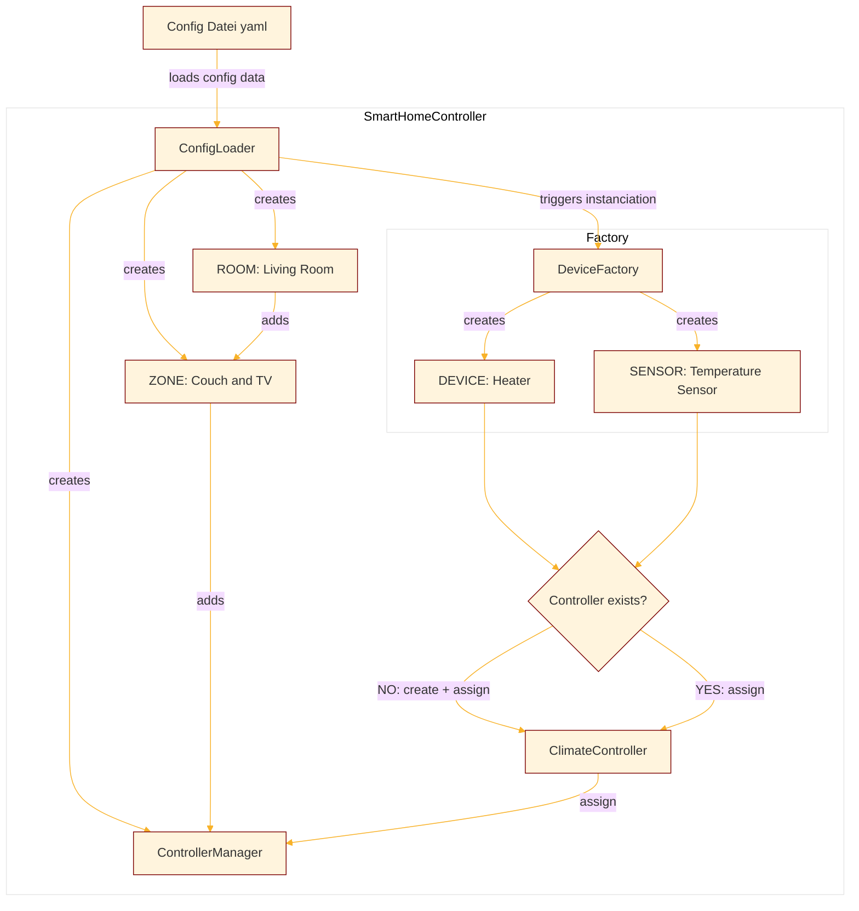
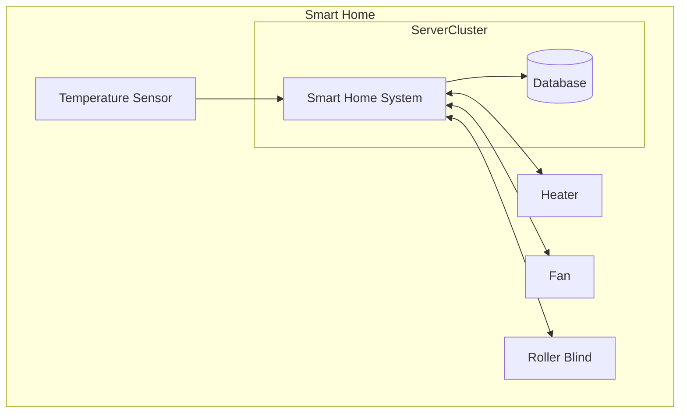

# 1 Einführung und Ziele {#section-introduction-and-goals}
## Aufgabenstellung {#_aufgabenstellung}
## Qualitätsziele {#_qualit_tsziele}
## Stakeholder {#_stakeholder}
++ Lisa


# 2 Randbedingungen {#section-architecture-constraints}
OO-Design, Python
O Lisa

# 3 Kontextabgrenzung {#section-system-scope-and-context}
Schnittstelle zu KI / Wetterstation / ...
## Fachlicher Kontext {#_fachlicher_kontext}
## Technischer Kontext {#_technischer_kontext}
+ 

# 4 Lösungsstrategie {#section-solution-strategy}
++ Luca

# 5 Bausteinsicht {#section-building-block-view}
## Whitebox Gesamtsystem {#_whitebox_gesamtsystem}
## Ebene 2 {#_ebene_2}
## Ebene 3 {#_ebene_3}
++ Luca

# 6 Laufzeitsicht {#section-runtime-view}
## Systemstart
Bevor das Smart Home System in der Lage ist seine Aufgabe zu erfüllen, 
muss das System konfiguriert und initiiert werden. Mithilfe einer `config.yaml`
ist es möglich das System, gemäß realer Anforderungen zu konfigurieren. 
Diese Konfigurationen werden eingelesen und die Instanzen daraufhin erstellt. 
Nachfolgend ein Beispiel, wie das System auf die Konfiguration reagiert: 
### Ausschnitt der `config.yaml`
```
rooms:
  - name: Living Room
    type: liveable
    zones:
      - name: Couch and TV
        devices:
          - name: Heater
            type: heater
        sensors:
          - name: Temperature Sensor
            type: temperature_sensor
```
Diese YAML Datei wird mit folgender Logik ausgelesen, um das Smart Home zu initialisieren:
### Instanziierungsprozess

Dieses Flussdiagramm beschreibt den grundlegenden Ablauf innerhalb des Smart Home Controllers, der die konfigurierten Geräte und Sensoren in der jeweiligen Zone des Raumes erstellt und sie den passenden Controllern zuweist:
- Die Konfigurationsdatei (YAML) wird geladen und die Daten werden an den "ConfigLoader" übergeben. Dieser Schritt ist der Ausgangspunkt für das gesamte System.

- er `ConfigLoader` erstellt `Living Room`, `Couch and TV` und den `ControllerManager` der Zone. Er wird der Zone hinzugefügt, während die Zone ihren jeweiligen Raum zugewiesen wird. 
-  Der `ConfigLoader` nutzt die Metadaten in der `config.yaml` und löst eine Instanziierung von `Heater` und `Temperature Sensor` über die `DeviceFactory` aus, die für die Erstellung von Geräten und Sensoren verantwortlich ist.
- Es wird überprüft, ob zu den erstellten Geräten und Sensoren der dazugehörende Controller (`ClimateController`) bereits existiert, der für die Steuerung dieser zuständig ist. Wenn kein `ClimateController` existiert, wird einer erstellt und den Geräten/Sensoren zugewiesen.
Wenn bereits ein `ClimateController` vorhanden ist, werden die Geräte diesem zugewiesen. 
- Abschließen wird der `ClimateController` wird dem `ControllerManager` zugewiesen, und das Smart Home System ist nun vollständig aufgebaut


Zusammenfassend handelt es sich bei diesem Flussdiagramm um eine vereinfachte Darstellung des Smart Homes, mithilfe der Konfigurationsdatei lassen sich eine Vielzahl an Räumen, Zonen, Geräte und Sensoren erstellen und den richtigen Controllern zuweisen. Die Visualisierung sollte diesen Prozess in seinen Grundzügen veranschaulichen.
## Verhalten zur Laufzeit

Das Sequenzdiagramm beschreibt beispielhaft den Prozess, wie sich der `FertilizationController` in unserem "smarten Gewächshaus" verhält, um die Düngung (Fertilization) steuern:
- Der Prozess beginnt, wenn die Main-Funktion den `SmartHomeController` aufruft, um die Methode `update()` auszuführen. Der `SmartHomeController` ist verantwortlich für die Gesamtsteuerung und Verwaltung des Smart Home Systems.

- In einem wiederholten Schleifenablauf, der alle 5 Sekunden stattfindet, ruft der `SmartHomeController` den `FertilizationController` auf, um die Düngungssteuerung durchzuführen.
Das Sequenzdiagramm beschreibt den Prozess, wie der "SmartHomeController" und der "FertilizationController" in regelmäßigen Abständen miteinander interagieren, um die Düngung (Fertilization) einer Pflanze zu steuern. Hier ist eine Beschreibung des Prozesses:

- Der `FertilizationController` beginnt, indem er den `FertilizationSensor` aufruft, um den aktuellen Düngungswert zu berechnen. Dieser berechnet den Wert und gibt ihn an den `FertilizationController` zurück.
- Nachdem der Düngungswert ermittelt wurde, wird eine Bedingung geprüft, ob der aktuelle Wert unter einem vorgegebenen Schwellenwert liegt oder nicht.
   - Wenn der Wert unter dem Schwellenwert liegt, ist es notwendig, zu düngen. Der `FertilizationController` ruft die Methode `fertilize(value: float)` des "Fertilizer" auf, um die Düngung mit dem berechneten Wert durchzuführen. Der `Fertilizer` ist das Gerät oder die Komponente, die für die tatsächliche Düngung der Pflanze verantwortlich ist.
   - Wenn der Wert über dem Schwellenwert liegt und das Düngungsgerät bereits läuft, dann muss die Düngung gestoppt werden. Der `FertilizationController` ruft die Methode `stop_fertilizing()` des `Fertilizer` auf, um die Düngung zu beenden.
- Der Schleifenablauf wird alle 5 Sekunden wiederholt, wodurch die Düngung der Pflanze periodisch überwacht und gesteuert wird.

# 7 Verteilungssicht {#section-deployment-view}
Aufgrund der Anforderungen an das Projekt wurden keine  Test, Development oder Produktivumgebung aufgesetzt.
Das Smart Home System ist zum jetztigen Stand ein lokal funktionierendes System, dass in Python geschrieben wurde und die Abläufe simuliert.
Wenn das System produktiv eingesetzt werden würde, müsste man die Sensoren sowie die smarten Geräte als Akteure eines verteilten Systems betrachten, die Daten sammeln. In diesem Zusammenhang ist es erfolderlich diese Daten in einer Server Struktur zu konsolidieren, die das lauffähige System bereitstellt. Das könnte in dieser Form umzusetzen sein.

Da unser System die Veränderungern der Sensoren lediglich simuliert und nicht mit realen Events arbeitet, würde das aktuelle System nicht ohne Anpassungen in dieser Form darstellbar sein. Jedoch schafft diese Visualisierung ein gutes Bild, wohin die Architektur gehen kann 
# 8 Querschnittliche Konzepte {#section-concepts}
## Package-Struktur
## Domänenmodell

OO
## Architektur-/ Entwurfsmuster
### Factory Pattern
Wir haben das Factory Pattern verwendet, um die Erzeugung von Geräten, Sensoren und Controllern in einem Smart-Home-System zu zentralisieren und zu abstrahieren. Dies führte zu einem sauberen und wartbaren Code, der die Verantwortlichkeiten klar trennt und den Clientcode von den Details der Objekterzeugung entkoppelt. Darüber hinaus ermöglichte das Factory Pattern eine einfache Erweiterung des Systems, da neue Geräte- und Sensortypen problemlos hinzugefügt werden konnten, ohne den bestehenden Code zu beeinträchtigen (Open-Closed-Principle).

In dem `SmartHomeController` wird die Erzeugung von Geräten, Sensoren und Controllern mithilfe der `DeviceFactory` zentralisiert. Die `DeviceFactory` stellt dafür drei Factory-Methoden bereit: `create_device`, `create_sensor` und `create_controller`. Bei der Erstellung von Geräten iteriert die Methode `load_rooms` über die Konfigurationsdaten und verwendet die `create_device`-Methode der `DeviceFactory`, um für jedes Gerät in der Konfiguration den passenden Gerätetyp (z. B. LEDLight) zu erstellen und eine entsprechende Instanz zurückzugeben. Gleiches gilt für die Erstellung von Sensoren und Controllern, bei denen die `create_sensor` bzw. `create_controller`-Methode verwendet wird.

Durch die Implementierung des Factory Patterns ergeben sich mehrere Vorteile. Erstens ermöglicht die zentrale Objekterzeugung durch die `DeviceFactory`, dass der Code übersichtlicher wird und die Logik zur Erzeugung der Komponenten leicht zugänglich ist. Zweitens kennt der `SmartHomeController` nicht die konkreten Geräte- und Sensorklassen, sondern greift über die Factory-Methode auf sie zu, was die Abhängigkeit von konkreten Implementierungen reduziert und die Flexibilität erhöht. Drittens fördert die Wiederverwendbarkeit der Factory die Code-Wiederverwendung, da neue Geräte- und Sensortypen einfach durch Hinzufügen von Einträgen in die entsprechenden Dictionaries der Factory unterstützt werden können, ohne dass der Hauptcode geändert werden muss. Viertens entkoppelt die Factory den Clientcode, in diesem Fall die `SmartHomeController`, von den Details der Objekterzeugung, wodurch der Code robuster und leichter wartbar wird.

Insgesamt ermöglicht das Factory Pattern eine klare Trennung der Verantwortlichkeiten, erhöht die Lesbarkeit des Codes und macht das System besser erweiterbar. Der `SmartHomeController` kann sich so auf seine Hauptaufgaben konzentrieren und bleibt übersichtlich, während die Erzeugung und Konfiguration der Geräte und Sensoren elegant und flexibel von der `DeviceFactory` gehandhabt wird. Diese Implementierung verbessert die Wartbarkeit und Skalierbarkeit des Smart-Home-Systems erheblich und bietet eine solide Grundlage für zukünftige Erweiterungen und Weiterentwicklungen.


### Template Method Pattern
Das Template Method Pattern wird hier verwendet, um eine abstrakte Struktur für die Implementierung von SwitchableDevice und AdjustableDevice-Klassen bereitzustellen. Das Ziel ist es, den Code für das Schalten von Geräten zu standardisieren, während gleichzeitig spezifische Implementierungsdetails für die Anpassung der Geräte ermöglicht werden.

Die Klasse "SwitchableDevice" enthält die grundlegende Logik für das Ein- und Ausschalten von Geräten. Sie definiert eine Template-Methode (eine Methode, die den allgemeinen Ablauf festlegt, aber einige Schritte den Unterklassen überlässt), die die Abfolge der Aktionen zum Ein- und Ausschalten eines Geräts beschreibt. 

Die Klasse "AdjustableDevice" erbt von "SwitchableDevice" und fügt die Funktionalität hinzu, um den Gerätepegel anzupassen. Auch hier wird das Template Method Pattern verwendet, um den allgemeinen Ablauf des Pegelsetzungsprozesses (bspw. Ober- und Untergenzen der Intensität) vorzugeben, aber die spezifische Implementierung des Pegelsetzens wird den Unterklassen überlassen.

Die Geräte-Klasse "Humidifier" ist beispielsweise eine Unterklassen-Implementierung von "AdjustableDevice". Sie erbt den Mechanismus zum Ein- und Ausschalten von Geräten und das Grundgerüst zum Setzen des Pegels. "Humidifier" implementiert dann die spezifischen Methoden "humidify" und "dehumidify", um den Feuchtigkeitspegel des Luftbefeuchters anzupassen. So hat jede Unterklasse eine gewisse Basisfunktionalität und kann eigene Methoden und Logik ergänzen.

Durch die Verwendung des Template Method Patterns werden also die allgemeinen Schritte zum Ein- und Ausschalten von Geräten sowie zum Einstellen des Pegels in den Basisklassen definiert und in den Unterklassen die spezifischen Details der jeweiligen Geräte implementiert. Dadurch wird der Code wiederverwendbar, reduziert Duplizierung und fördert eine klare Trennung zwischen allgemeiner Struktur und spezifischer Implementierung.

### Strategy Pattern

Das Strategy Pattern ermöglicht die Trennung von Algorithmen und deren Verwendung, was den Code flexibler und leichter erweiterbar macht.

Die abstrakte Klasse `Strategy` bildet die die Grundlage für verschiedene Strategien. Diese Klasse definiert eine abstrakte Methode namens `calculate_value`, die von den konkreten Strategien implementiert werden muss. Die konkreten Strategien `Average`, `Maximal` und `Minimal` erben von dieser abstrakten Klasse und berechnen jeweils den Durchschnitt, das Maximum und das Minimum der übergebenen Sensordaten.

Die abstrakte Klasse `Controller` dient als Kontext und enthält eine Referenz auf eine konkrete Strategie. Sie ermöglicht es, die aktuelle Strategie abzurufen. Die Klasse `HumidityController` erbt neben vielen weiteren Controllern von `Controller` und stellt eine konkrete Implementierung dar. Hier wird das Strategy Pattern verwendet, um die Strategie für die Feuchtigkeitsregelung auszuwählen (z. B. Average, Maximal oder Minimal). Die Methode `control_humidity` nutzt beispielsweise die ausgewählte Strategie, um den gewünschten Feuchtigkeitswert zu berechnen und die entsprechenden Geräte entsprechend zu steuern.

Durch die Verwendung des Strategy Patterns bleibt die `Controller`-Klasse unabhängig von den Details der verwendeten Strategie. Dadurch wird der Code besser strukturiert und erleichtert die Implementierung neuer Strategien in der Zukunft, ohne den Kerncode der `Controller`-Klasse ändern zu müssen. Dadurch wird das Smart Home System flexibler und anpassungsfähiger für verschiedene Anwendungsanforderungen.

## Logging

In unserem Smart-Home-Projekt verwenden wir das Logging-Konzept, um wichtige Informationen über den Betrieb und den aktuellen Zustand des Systems zu erfassen und zu protokollieren. Dabei nutzen wir verschiedene Log-Level wie DEBUG, INFO, WARNING und ERROR, um die Bedeutung der Protokollmeldungen zu kennzeichnen. Jede Protokollmeldung enthält relevante Informationen über den aktuellen Zustand der Geräte, Sensoren und Controller im Smart Home.

Um die Protokolle zu verwalten, erstellen wir Logger-Objekte mithilfe des `logging`-Moduls in Python. Jeder Logger ist mit einem eindeutigen Namen versehen und dient dazu, Protokollmeldungen für einen bestimmten Bereich oder ein spezifisches Modul zu erfassen. Dadurch behalten wir die Übersichtlichkeit und können die Meldungen entsprechend kategorisieren.

Für die Ausgabe der Protokollmeldungen nutzen wir verschiedene Handler-Typen. Einerseits haben wir den `console_handler`, der die Protokollmeldungen während der Entwicklung auf der Konsole ausgibt. Dadurch können Entwickler die Informationen direkt während der Arbeit sehen. Andererseits verwenden wir den `file_handler`, um die Protokolle in rotierende Dateien zu schreiben. Dies ermöglicht uns, die Protokolle über einen längeren Zeitraum aufzuzeichnen und auf potenzielle Probleme oder Ereignisse zurückzublicken.

Um das Format der Protokollmeldungen zu definieren, haben wir einen benutzerdefinierten Formatter namens `CustomLogRecord` erstellt. In diesem Format werden das Datum, das Log-Level, der Modulname, der Logger-Name und die eigentliche Protokollnachricht enthalten. Dadurch haben wir eine klare Strukturierung der Protokollmeldungen und können relevante Informationen schnell erfassen.

Die Konfiguration des Logging-Systems wird von der `LoggerFactory` durchgeführt. Hier werden die Logger erstellt und mit den passenden Handlern und Formattern ausgestattet. Dank dieser Konfiguration können wir die Protokollierungsstufe und die Ausgabeziele flexibel anpassen, je nachdem, was in einem bestimmten Entwicklungs- oder Testabschnitt am wichtigsten ist.

Insgesamt nutzt unser Smart-Home-Projekt das Logging-Konzept, um den Zustand und die Aktivitäten der Geräte, Sensoren und Controller im Smart Home zu protokollieren. Dies ermöglicht uns, das Verhalten des Systems zu überwachen, potenzielle Probleme zu erkennen und Fehler zu diagnostizieren. Die Protokolle dienen als wertvolle Werkzeuge für das Debugging und das Monitoring des Systems und unterstützen uns dabei, die Effizienz und Zuverlässigkeit unseres Smart Homes zu verbessern.

## Tests

Das Testkonzept wurde entwickelt, um die Funktionalität und Zuverlässigkeit unseres Smart-Home-Systems sicherzustellen. Die Tests sind in Python mithilfe des `pytest`-Frameworks implementiert und decken verschiedene Aspekte des Systems ab.

Zunächst gibt es spezifische Tests für die Devices, die im Smart-Home verwendet werden. Dazu gehören einstellbare Geräte wie AdjustableDevice und schaltbare Geräte wie SwitchableDevice. Diese Tests prüfen, ob die Geräte ihre Funktionen ordnungsgemäß ausführen. Beispielsweise wird getestet, ob die Einstellungen innerhalb des erlaubten Wertebereichs liegen, ob die Geräte ein- und ausgeschaltet werden können und ob die Werte entsprechend den Erwartungen geändert werden.

Der Controller ist ein entscheidendes Element im System, der die Verwaltung von Devices und Sensoren übernimmt. Es gibt Tests, um sicherzustellen, dass der Controller Geräte und Sensoren korrekt hinzufügen, entfernen und verwalten kann. Die Interaktion zwischen dem Controller und den Geräten/Sensoren wird ebenfalls überprüft, um sicherzustellen, dass die Devices und Sensoren reibungslos mit dem Controller zusammenarbeiten.

Ein weiterer wichtiger Aspekt sind die Tests für den Controller Manager. Dieser ist verantwortlich für das Verwalten mehrerer Controller. Die Tests gewährleisten, dass der Manager in der Lage ist, neue Controller hinzuzufügen, sie zu identifizieren und Informationen über vorhandene Controller zurückzugeben.

Zusätzlich werden Raum- und Zonentests durchgeführt. Hier wird beispielsweise überprüft, ob Räume Zonen hinzufügen und wie gut sie diese verwalten können.

Da Sensoren im System eine zentrale Rolle spielen, gibt es umfangreiche Sensortests. Diese gewährleisten, dass die Sensoren korrekte Werte liefern und angemessen auf Änderungen in den Devices reagieren.


Das Testkonzept sorgt dafür, dass jede Komponente des Smart-Home-Systems zuverlässig funktioniert. Es stellt sicher, dass das System frei von unerwarteten Fehlern ist und den gestellten Anforderungen entspricht. Durch die automatisierten Tests können auch Änderungen und Erweiterungen im Code effizient überprüft werden, um potenzielle Probleme frühzeitig zu erkennen und zu beheben. Das führt zu einer stabilen und verlässlichen Smart-Home-Anwendung.
+ Johanna

# 9 Architekturentscheidungen {#section-design-decisions}
Am Ende: was wurde noch nicht beschrieben?
- Johanna

# 10 Qualitätsanforderungen {#section-quality-scenarios}
## Qualitätsbaum {#_qualit_tsbaum}
## Qualitätsszenarien {#_qualit_tsszenarien}
++ 

# 11 Risiken und technische Schulden {#section-technical-risks}
Observer Pattern für Sensoren wäre besser gewesen
Sicherheitskonzept fehlend
Input Validation für Config File und error handling -> Beim Einlesen wird davon ausgegangen, dass die Config-File richtig ist
Kapselung der turn_on-/turn_off-/...-Befehle in ein Objekt
O


# 12 Glossar {#section-glossary}
jeder ein bisschen wenn notwendig

# Aufgabenverteilung
**Implementierung und Architektur**  
Config -> Luca
Aufbau des Smart-Homes mit Räumen/Zonen/Controllern/etc -> Luca, Lisa, Johanna
Konzept für Logik der Geräte, Controller, Sensoren im Zusammenspiel (Veränderung der Werte je nach Sensor-Wert und Stärke der Geräte) -> Aidan, Johanna
Implementierung der Geräte, Controller, Sensoren -> Lisa, Johanna  
Strategie-Pattern -> Johanna  
KI-Anbindung -> Johanna  
Logging -> Kevin, Luca  
Tests -> Dennis  


**Dokumentation**  
1 -> Lisa  
2 -> Lisa  
3  
4 -> Luca  
5 -> Luca  
6 -> Aidan  
7 -> Aidan  
8 -> Johanna  
9 -> Johanna  
10  
11  
12 -> Alle  
